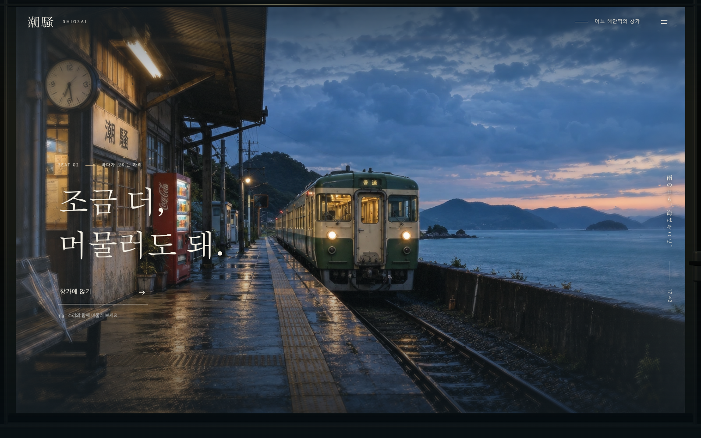

# 潮騒 — 창가에 남은 시간

비 오는 일본의 작은 해안역을 바라보며 잠시 머무는 창가 체험. 젖은 승강장의 따뜻한 빛, 흐르는 빗방울, 낮은 파도와 객실 소리, 그리고 나에게 남기는 한 장의 엽서.



## 실행

```sh
npm install
npm run dev
```

http://127.0.0.1:5174 에서 **창가에 앉기**를 누른다. Node.js 20.19+ 또는 22.12+ 필요. 상위 프로젝트의 실행 설정에 관계없이 이 폴더에서 실행할 수 있다.

## 창가에서

- 창을 드래그해 김을 닦는다. 닦은 자국은 천천히 돌아온다. 키보드 C와 설정의 ‘창을 맑게 닦기’로도 사용할 수 있다.
- **저녁의 여운 / 마지막 불빛**으로 시간대를 바꾼다. 전철은 정차한 풍경이다.
- **소리**로 빗소리·파도·객실의 낮은 진동·드문 역 차임을 듣는다. 소리는 진입 버튼을 누른 뒤 켜진다. 설정에서 음량과 비를 조절할 수 있다.
- **이 순간 간직하기**에서 한 줄을 적고 1800×1440 PNG 엽서를 저장한다. 글은 이 브라우저의 localStorage에만 보관하고 외부로 전송하지 않는다. 저장이 차단된 환경에서도 PNG 다운로드는 된다.
- 설정의 **소리와 함께 12초 담기**로 H.264/AAC MP4 또는 WebM을 저장한다. 다시 눌러 일찍 마칠 수 있다. 현재 소리 설정이 녹음에 반영되므로 음소거 상태면 무음이다. 녹화 중 다른 탭으로 이동하면 그 시점까지 저장한다.
- **H / Escape**로 조작 숨기기 / 표시. 캔버스에서 **Space**로 정지·재생, **방향키**로 작은 시점 이동.

모션 감소 설정에서는 시점 추종과 풍경의 움직임을 끄고, 시간대를 즉시 전환한다. 이 설정이어도 진입 후 소리는 들을 수 있다. 정지 상태에서 변화가 없으면 렌더하지 않는다. 녹화는 사용자가 요청한 동안만 움직인다.

## 구현 범위

기본 창가는 **생성한 실사풍 이미지 + Three.js의 얕은 깊이 메시·3D 창틀 + 실시간 유리/수면 셰이더**를 합성한 2.5D 작품이다. 실제 장소를 촬영한 것이 아니며, 창밖을 모든 방향에서 돌아다닐 수 있는 실사 3D 월드는 아니다. 장면의 자연스러운 밀도를 확보하기 위해 이 매체를 선택했다.

설정의 [3D 승강장 둘러보기](http://127.0.0.1:5174/station.html)는 앞서 만든 자유 시점 Three.js 장면이다. 승강장·해안선·열차 근접 구도, 움직이는 열차, PNG·영상 저장을 유지했다. 이 모드의 기존 영상 저장에는 소리가 없다.

- `src/window/scene.js`: Three.js 렌더, 깊이 메시, 시차, 입력·김 닦기·정지.
- `src/window/shaders.js`: 굴절과 빗방울, 김, 객실 반사, 수면.
- `src/window/cabin.js`: 실제 3D 창틀·고무 패킹·금속 테두리·잠금장치.
- `src/window/audio.js`: 외부 샘플 없는 자체 합성 환경음, 스테레오, 영상 음성 트랙.
- `src/window/app.js`, `postcard.js`, `style.css`: UI·접근성·엽서·영상 저장.
- `src/world.js` 이하 기존 파일: 자유 시점 승강장.

이미지 생성 도구·최종 프롬프트·원본은 [artwork/PROVENANCE.md](artwork/PROVENANCE.md). 실행 이미지와 해시는 [sources.json](public/assets/window/sources.json). 이미지는 로컬 WebP이며 앱은 외부 CDN·분석·이미지 API를 호출하지 않는다.

기존 승강장의 Poly Haven CC0 재질 출처는 [소재 목록](public/assets/sources.json)에 있다. 원본은 [Venice Sunset](https://polyhaven.com/a/venice_sunset), [Asphalt 02](https://polyhaven.com/a/asphalt_02), [Concrete Floor 02](https://polyhaven.com/a/concrete_floor_02), [Gravel Stones](https://polyhaven.com/a/gravel_stones), [Wood Planks](https://polyhaven.com/a/wood_planks).

## 검증과 샘플

```sh
npm run check
npm test
npm run test:window    # 개발 서버 + 로컬 Chrome
npm run test:e2e       # 기존 승강장
npm run build
npm run preview       # http://127.0.0.1:4174
```

`dist/`를 정적 호스팅의 루트에 배포하면 창가와 승강장이 함께 작동한다. 서버 경로의 하위 디렉터리에 배포하려면 현재 절대 에셋 경로를 먼저 조정해야 한다.

[창가 12초 영상](exports/window-preview.mp4) · [엽서 샘플](exports/window-postcard.png) · [검증 기록](WINDOW-REVIEW.md)

[기존 승강장 사진](exports/shiosai-sunset.png) · [기존 승강장 영상](exports/shiosai-preview.mp4) · [이전 자기비평](REVIEW.md)

`npm run export:window`로 새 창가 샘플, `npm run export:preview`로 기존 승강장 샘플을 다시 만든다. 유료 서비스로서의 결제 의향이나 방문자 반응을 측정한 것은 아니다.
