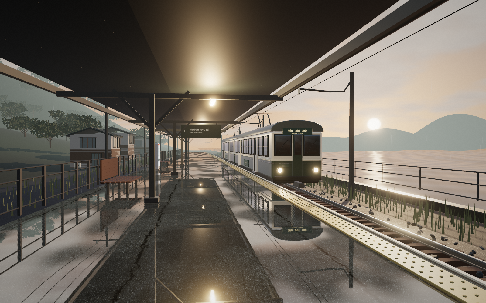

# 潮騒 — 비가 머문 역

비가 갠 일본의 작은 해안역을 떠올리며 만든 실사풍 Three.js 작품입니다. 젖은 승강장, 녹색 전철, 따뜻한 처마 조명과 바다가 한 장면에 담깁니다. 실제 역을 그대로 복제한 것이 아닌 가상의 장소입니다.



## 실행

이 폴더에서 다음 명령을 실행합니다. Node.js 20.19 이상 또는 22.12 이상이 필요합니다.

```sh
npm install
npm run dev
```

브라우저에서 http://127.0.0.1:5174 를 엽니다. 상위 폴더에서는 `npm run dev:02`로 실행할 수 있습니다.

```sh
npm run check
npm test
npm run build
```

`npm run preview`는 빌드 결과를 http://127.0.0.1:4174 에서 엽니다. `dist/`를 정적 호스팅의 루트에 배포할 수 있습니다.

## 감상과 저장

- **승강장 / 해안선 / 가까이:** 세 가지 촬영 시점. 드래그로 자유롭게 회전하고 휠이나 핀치로 확대합니다.
- **해질녘 / 푸른밤:** 하늘, 바다, 조명과 차창의 분위기를 전환합니다.
- **재생 / 정지:** 열차·비·파도·구름의 시간을 함께 제어합니다. 정지 상태에서도 카메라와 시간대는 바꿀 수 있습니다.
- **비 / 소리:** 빗줄기를 숨기거나 파도 분위기의 합성 환경음을 켭니다. 소리는 버튼을 누른 후에만 재생됩니다.
- **사진 / 영상:** 조작 화면을 제외한 풍경을 PNG 또는 12초 영상으로 저장합니다. 녹화 중 영상 버튼을 다시 누르면 일찍 저장합니다. 지원 브라우저에서는 MP4, 그 외에는 WebM을 사용합니다. 영상에는 소리가 포함되지 않습니다.
- **H / Escape:** 조작 화면 숨기기 / 다시 표시. 캔버스를 선택한 뒤 Space로 정지·재생, 방향키로 회전합니다.

모션 감소 설정에서는 풍경이 정지된 상태로 시작합니다. 모바일에는 별도의 카메라 구도를 사용합니다. 사진·영상의 해상도는 현재 캔버스 크기를 따릅니다.

## 샘플

[해질녘 사진](exports/shiosai-sunset.png) · [푸른 밤 사진](exports/shiosai-blue-hour.png) · [12초 영상](exports/shiosai-preview.mp4)

개발 서버가 켜져 있을 때 `npm run export:preview`로 다시 만들 수 있습니다. 샘플 생성과 `npm run test:e2e`에는 로컬 Chrome이 필요합니다.

## 구성과 소재

`src/world.js`가 조명과 카메라, 후처리를 관리합니다. `station.js`는 역과 반사 바닥, `train.js`는 전철, `environment.js`는 바다·하늘·마을·식생·비, `motion.js`는 열차의 정차·출발·도착을 담당합니다. UI와 다운로드는 `main.js`에 있습니다.

Three.js의 물리 기반 재질, HDR 환경 조명, 평면 반사, 톤 매핑과 약한 필름 그레인을 사용합니다. 실사풍 분위기를 목표로 한 실시간 3D 장면이며, 사진 측량 모델이나 경로 추적 렌더러를 사용한 작업은 아닙니다.

Poly Haven의 다음 CC0 소재를 프로젝트에 함께 저장했습니다. 실행할 때 외부 CDN이나 API를 호출하지 않습니다.

| 소재 | 사용처 |
|---|---|
| [Venice Sunset](https://polyhaven.com/a/venice_sunset) | HDR 조명과 재질의 환경 반사 |
| [Asphalt 02](https://polyhaven.com/a/asphalt_02) | 지면·선로 주변과 젖은 바닥 |
| [Concrete Floor 02](https://polyhaven.com/a/concrete_floor_02) | 승강장 콘크리트 |

파일별 원본 주소, 라이선스, SHA-256은 [sources.json](public/assets/sources.json)에 있습니다. 재다운로드는 `python3 scripts/fetch-assets.py`로 실행합니다. 모델·하늘·바다·간판·아이콘·환경음은 이 프로젝트의 코드로 구성했습니다.
